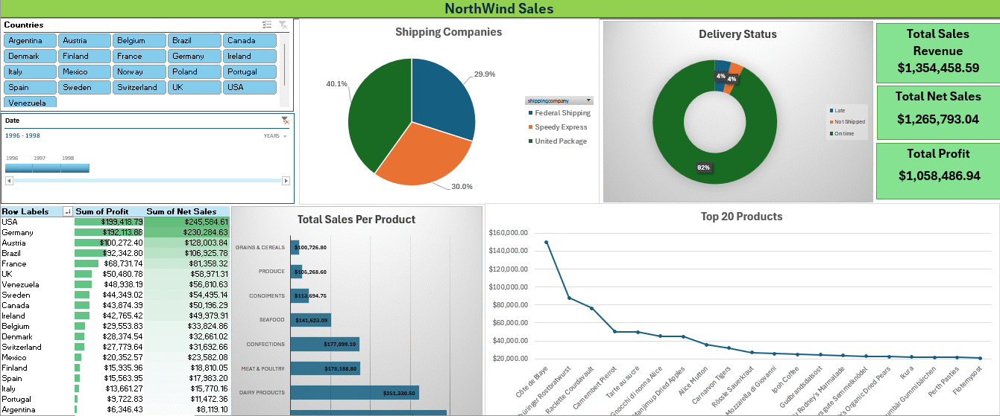

# Northwind_Trading_Company

An end-to-end data analysis project examining three years of sales data for Northwind Trading Company, a fictional specialty food distributor. The project covers data exploration, dashboard design in Excel, and a written report summarising findings and strategic recommendations.

---

## Project Overview

Northwind Trading Company operates across 21 countries, distributing eight product categories including Beverages, Dairy Products, Meat & Poultry, and Seafood. This project analyses 2,155 orders placed between 1996 and 1998 to surface insights across revenue performance, geographic markets, product categories, customer behaviour, and logistics.

---

## Key Findings

- **Total revenue:** $1,354,458 across the three-year period
- **Total profit:** $1,058,487 — representing an 83.5% profit margin on net sales
- **Top markets:** USA and Germany account for nearly 37% of total profit
- **Top product:** Cote de Blaye generated $149,984 in revenue — nearly double the second-ranked product
- **Top customers:** QUICK, SAVEA, and ERNSH collectively represent 25.6% of total revenue
- **Delivery performance:** 92.3% of orders delivered on time; 73 orders unshipped at time of data capture
- **Seasonal trend:** April was the strongest month ($176,832); June the weakest ($36,363)

---

## Files in this Repository

| File | Description |
|------|-------------|
| `northwind_dashboard.gif` | Preview of the Excel dashboard |
| `Northwind_Sales_Report - Google Docs.pdf` | Full written report with findings and recommendations |
| `Excel_Assessment.xlsx` | Excel workbook with pivot tables and dashboard |

---

## Dashboard

The Excel dashboard includes:
- Country-level profit and net sales table with conditional formatting
- Shipping company breakdown (pie chart)
- Delivery status breakdown (donut chart)
- Total sales per product category (bar chart)
- Top 20 products by revenue (line chart)
- Year and country filters (1996–1998)
- KPI cards for Total Sales Revenue, Net Sales, and Total Profit

---

## Report Structure

The written report (`Northwind_Sales_Report - Google Docs.pdf`) is structured as follows:

1. **Introduction** — scope, context, and areas of focus
2. **Findings & Insights** — seven sections covering financial performance, geographic breakdown, monthly trends, product categories, top products, top customers, and logistics
3. **Recommendations** — five actionable recommendations covering market prioritisation, the mid-year revenue dip, category investment, customer concentration risk, and logistics improvement

---

## Tools Used

- **Microsoft Excel** — data cleaning, pivot tables, dashboard design
- **Microsoft Word** — written report

---

## Data Sources

- [Kaggle — Northwind Orders and Order Details](https://www.kaggle.com/datasets/emmanueltugbeh/northwind-orders-and-order-details?select=northwind_orders.csv) by Emmanuel Tugbeh
- [Maven Analytics Data Playground — Northwind Traders](https://mavenanalytics.io/data-playground/northwind-traders)

---

## Author

**Ayodeji** — Data & Financial Analysis  
[LinkedIn](#) <!-- https://www.linkedin.com/in/ayodeji-jakande-5a4054325/ -->
